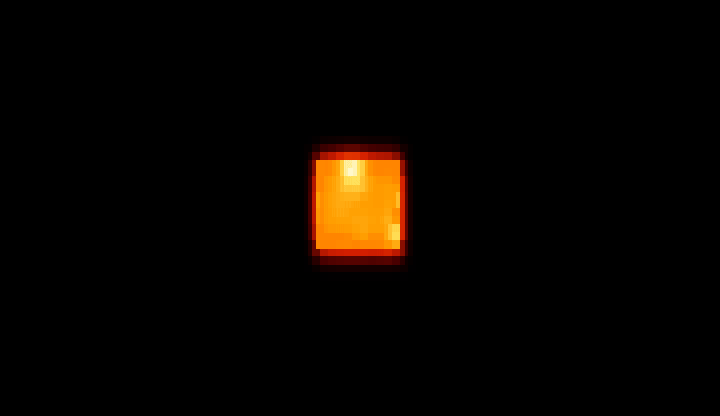

# 🔥 fire-cube

[](LICENSE)
[](https://mojolang.org)
[](https://pixi.prefix.dev)
[](#requirements)

A rotating wireframe cube — the classic ASCII-art demoscene trick — reimagined
as a burning plasma sun, rendered live in your terminal. Written in
[Mojo](https://mojolang.org), with a SIMD-accelerated fire simulation,
per-face directional lighting, procedural sunspot turbulence, a bloom corona,
and 2×2 quadrant-block subpixel rendering for far more detail than a plain
ASCII grid.



## Table of Contents

- [What it does](#what-it-does)
- [Requirements](#requirements)
- [Quick start](#quick-start)
- [Prebuilt binaries](#prebuilt-binaries)
- [How it works](#how-it-works)
- [Contributing](#contributing)
- [Credits](#credits)
- [License](#license)

## What it does

- Projects and rotates a 3D cube using the same trigonometric core as the
  classic [`donut.c`](https://www.a1k0n.net/2011/07/20/donut-math.html) /
  `cube.c` ASCII-rotation demos — no 3D engine, just `sin`/`cos` and a
  perspective divide.
- Lights each face like a headlamp at the camera: whichever faces are
  currently turned toward you blaze bright, the ones turning away fall into
  a dim ember glow — dynamic, continuously shifting shading as the cube
  tumbles, not six flat colors.
- Textures the surface with procedural turbulence (three multiplied sine/
  cosine octaves) so it reads as roiling plasma with dark sunspot patches,
  not a smooth solid.
- Simulates rising, cooling fire off the cube's surface every frame — an
  isotropic 3×3 box blur pass, SIMD-vectorized across each row.
- Wraps the cube in a soft bright corona, the way a real sun's corona
  surrounds its disk, via repeated SIMD box blurs of the fire buffer
  (kept separate from the simulation state, so it can't feed back and
  bloom out of control).
- Doubles the effective resolution in **both** directions using 2×2
  quadrant Unicode block characters (`▘▝▖▗▌▐▀▄▚▞▛▜▙▟█`) instead of plain
  full-block cells — each terminal character carries 4 independent
  subpixels instead of 1.
- Adapts to your terminal size live, every frame — resize the window and
  the cube resizes with it.

## Requirements

- [pixi](https://pixi.prefix.dev) — manages the Mojo toolchain
- macOS (Apple Silicon) or Linux (x86_64 / aarch64) — `pixi.toml` pins
  `osx-arm64`, `linux-64`, and `linux-aarch64`. Windows isn't supported by
  Mojo directly; use WSL2, which resolves as one of the Linux platforms.

## Quick start

```bash
git clone https://github.com/iinoshirozheng/fire-cube.git
cd fire-cube
pixi run cube
```

Press `Ctrl+C` to stop — it runs forever, like the demos it's descended
from.

## Prebuilt binaries

Tagged releases build a standalone executable for each platform via CI
([`.github/workflows/build.yml`](.github/workflows/build.yml)) — grab one
from the [Releases](https://github.com/iinoshirozheng/fire-cube/releases)
page instead of installing pixi/Mojo. The binary still needs a Python 3
interpreter on `PATH` at runtime (used only to read the terminal size via
`shutil.get_terminal_size()`), which macOS and virtually every Linux distro
already ship.

To build one yourself for your current platform:

```bash
pixi run build   # -> dist/fire-cube
```

## How it works

The whole thing lives in [`src/cube.mojo`](src/cube.mojo). Roughly, per
frame:

1. **`step_fire`** — every pixel in the fire buffer rises one row, cools a
   little, and blurs sideways with its neighbors. The 3-tap horizontal
   blend is vectorized in `SIMD_WIDTH`-wide lanes via
   `UnsafePointer.unsafe_load/unsafe_store`; the two edge pixels per row
   fall back to scalar code so the vectorized loop never reads out of
   bounds.
2. **`draw_cube`** — samples the cube's 6 faces on a grid, projects each
   point with a standard perspective divide, and z-buffers to keep only
   the nearest surface per pixel. Each hit computes:
   - `facing`: the face's normal rotated by the same angles as the cube,
     dotted against the view direction — this is the light/shadow term.
   - `surface_turbulence`: three multiplied sine waves driven by position
     *and* the rotation angles, so the plasma texture never freezes or
     repeats.
3. **`compute_corona`** — 3 passes of an isotropic SIMD box blur over the
   fire buffer, written into scratch buffers so the simulation state
   itself is untouched. Composited at render time as
   `max(fire, corona * strength)`.
4. **`render_frame`** — packs each terminal cell's 2×2 subpixel block into
   one glyph: splits the 4 values into a bright/dim group by their own
   mean, uses each group's average as the ANSI truecolor foreground/
   background, and picks whichever of the 16 quadrant glyphs matches the
   bright group's shape.

Terminal character cells are roughly twice as tall as wide, and a 2×2
quadrant subpixel is *not* square as a result — the horizontal projection
term carries an extra `× 2` factor to compensate (the same fix the
original `cube.c` used, reintroduced here once quadrant rendering made the
subpixel grid anisotropic again).

## Contributing

Bug reports, tuning suggestions, and PRs are welcome — see
[CONTRIBUTING.md](CONTRIBUTING.md) for how to set up the dev environment and
what to know before touching the Mojo code.

## Credits

Rotation math and per-face structure adapted from
[tarantino07/cube.c](https://github.com/tarantino07/cube.c), itself in the
long ASCII-rotating-solid demoscene tradition started by `donut.c`.
Everything else — the fire/corona simulation, lighting, turbulence, and
quadrant rendering — is new.

## License

[MIT](LICENSE)
